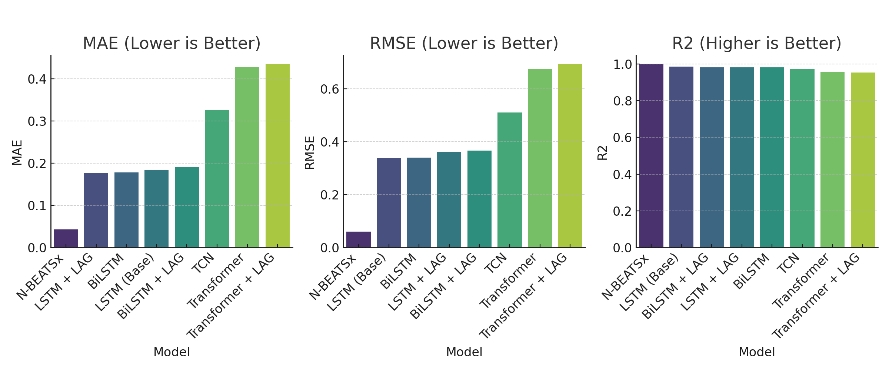
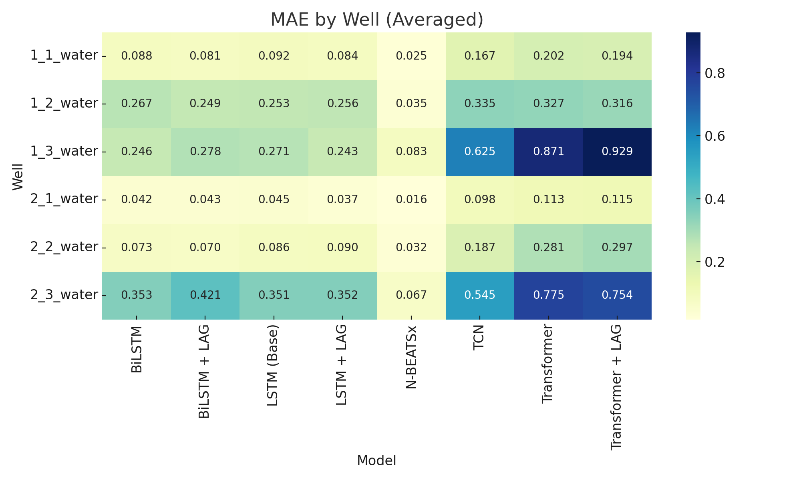
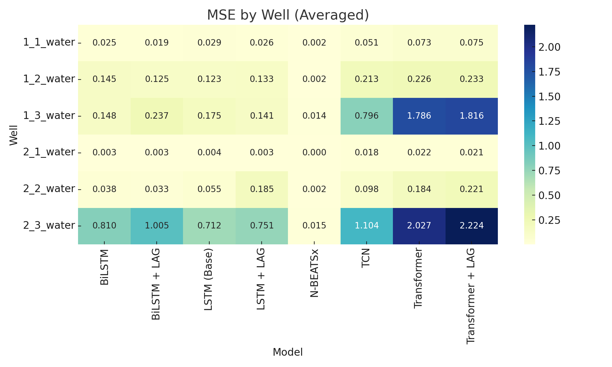
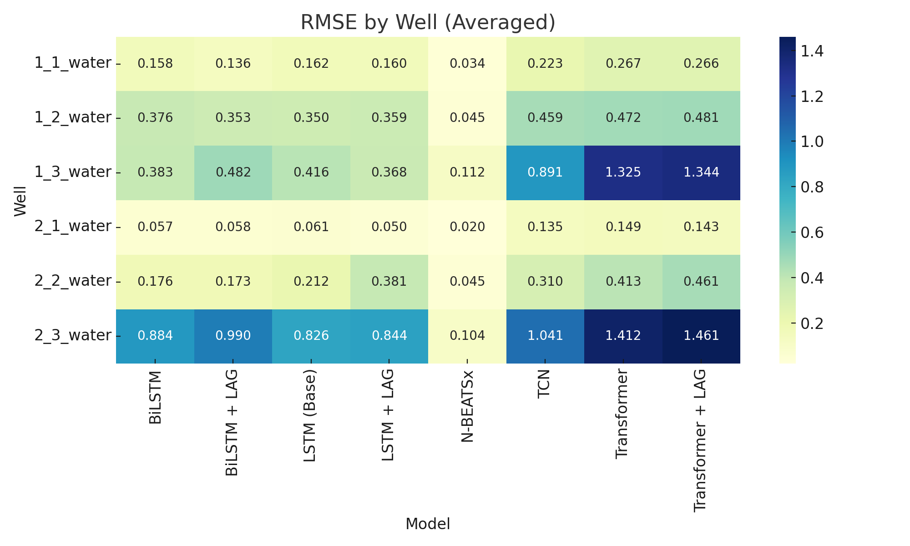
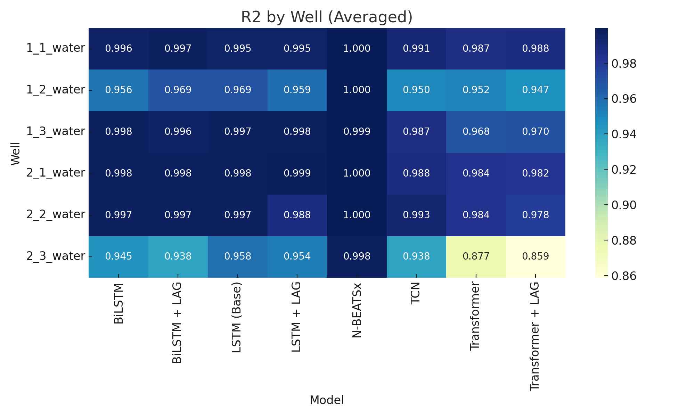
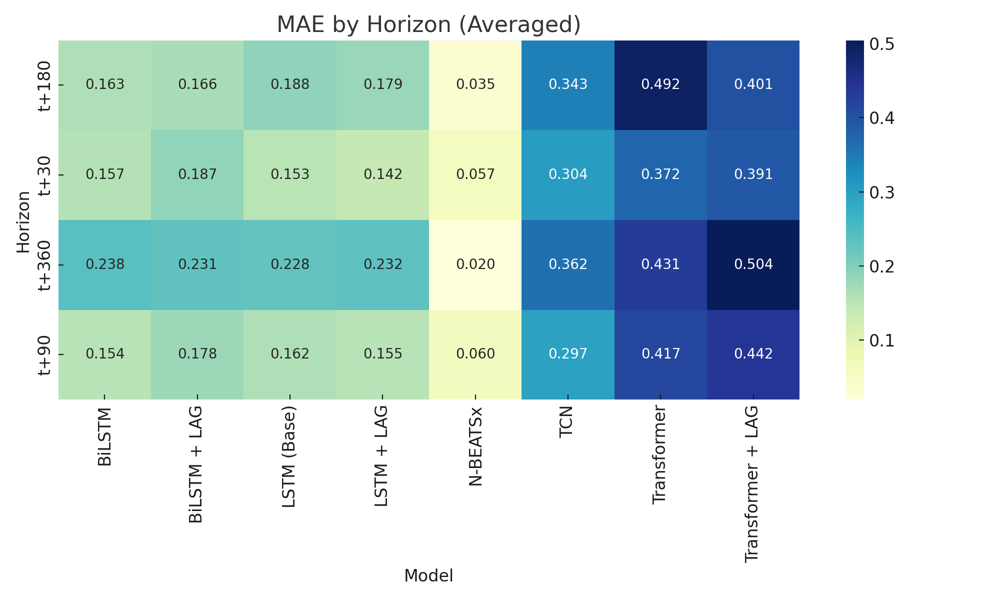
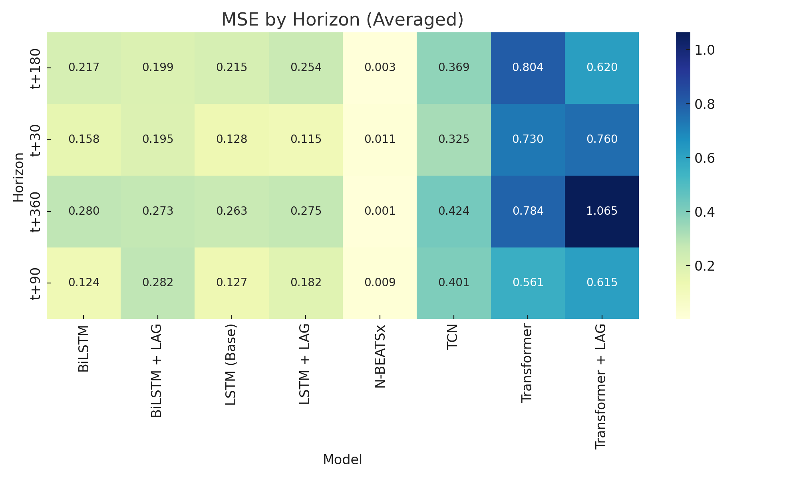
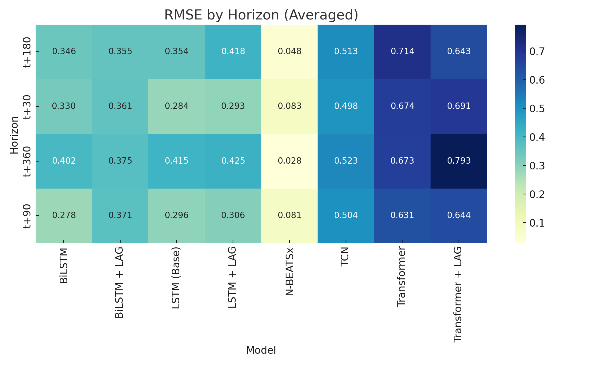
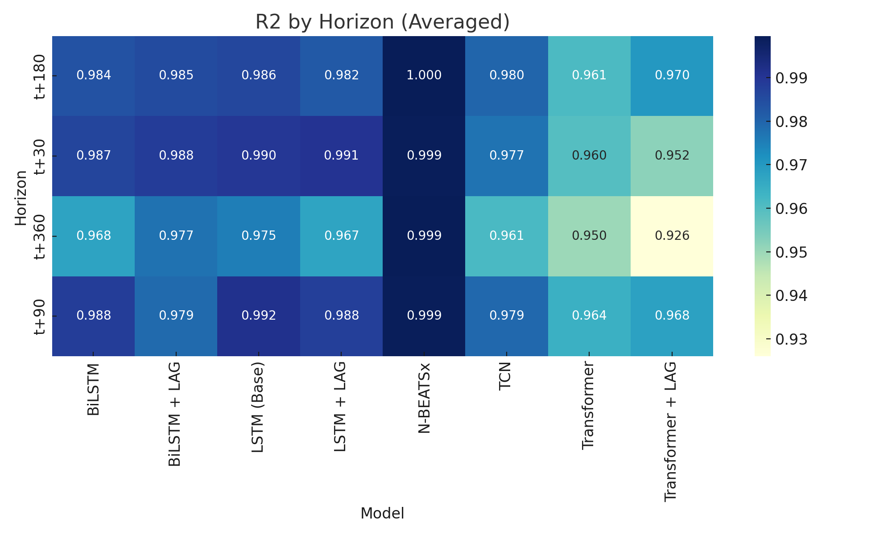

# Groundwater Forecasting Model Comparison

This document summarizes the experimental setup and results of multiple deep learning models applied to groundwater level forecasting.

---

## 1. Dataset

* **Source**: `JeJu_merged.csv`
* **Targets**: 6 groundwater well levels (`1_1_water` to `2_3_water`)
* **Horizons**: Predictions made for `t+30`, `t+90`, `t+180`, `t+360` days
* **Window Map**: `{30: 90, 90: 180, 180: 360, 360: 540}`
* **Scaling**: `StandardScaler` applied to inputs and outputs

---

## 2. Model Summary Table

| Model           | Architecture          | LAG | Loss         | Output File                    |
| --------------- | --------------------- | --- | ------------ | ------------------------------ |
| LSTM (Base)     | LSTM (Unidirectional) | No  | SmoothL1Loss | `lstm_layer1_report.pdf`       |
| BiLSTM          | BiLSTM                | No  | SmoothL1Loss | `bilstm_report.pdf`            |
| LSTM + LAG      | BiLSTM                | Yes | SmoothL1Loss | `bilstm_with_lag_report.pdf`   |
| BiLSTM + LAG    | BiLSTM                | Yes | SmoothL1Loss | `bilstm_with_lag_report.pdf`   |
| TCN             | Temporal CNN          | Yes | MSELoss      | `tcn_report.pdf`               |
| Transformer     | Transformer Encoder   | No  | MSELoss      | `transformer_report_nolag.pdf` |
| Transformer+LAG | Transformer Encoder   | Yes | MSELoss      | `transformer_report.pdf`       |
| N-BEATSx        | Stacked FC Blocks     | Yes | MSELoss      | `nbeats_report.pdf`            |

---

## 3. Hyperparameters (All models)

| Model           | Layers | Hidden Dim | Batch Size | Epochs | LR    |
| --------------- | ------ | ---------- | ---------- | ------ | ----- |
| LSTM (Base)     | 2      | 128        | 64         | 100    | 0.001 |
| BiLSTM          | 2      | 128        | 64         | 100    | 0.001 |
| LSTM + LAG      | 2      | 128        | 64         | 100    | 0.001 |
| BiLSTM + LAG    | 2      | 128        | 64         | 100    | 0.001 |
| TCN             | 4      | 64         | 32         | 100    | 0.001 |
| Transformer     | 2      | 128        | 32         | 100    | 0.001 |
| Transformer+LAG | 2      | 128        | 32         | 100    | 0.001 |
| N-BEATSx        | 4x3x2  | 128        | 32         | 100    | 0.001 |

---

## 4. Evaluation Metrics (Overall Average)

| Metric | Best Model |
| ------ | ---------- |
| MAE    | N-BEATSx   |
| MSE    | N-BEATSx   |
| RMSE   | N-BEATSx   |
| R²     | N-BEATSx   |

---

## 5. Evaluation by Well

* For all 6 wells, **N-BEATSx** achieved the best performance across **all metrics** (MAE, MSE, RMSE, R²)

### Heatmaps by Well

---

## 6. Evaluation by Horizon

* Across all time horizons (`t+30`, `t+90`, `t+180`, `t+360`), **N-BEATSx** consistently outperformed other models on **all metrics**

### Heatmaps by Horizon

---

## 7. Experimental Validity

All models were trained and evaluated under the same conditions:

* Identical data splits, scaling, and time horizons
* Same evaluation metrics (MAE, MSE, RMSE, R²)
* Matching learning rate (0.001), epochs (100), and window sizes
* Only minor variation: some models use `SmoothL1Loss` vs `MSELoss` during training (evaluation remains comparable)

✅ **Conclusion**: Results are fairly comparable, and `N-BEATSx` shows the most promising performance across the board.

---

---

## 💬 한국어 버전 전체

이 문서는 지하수 수위 예측을 위해 다양한 딥러닝 모델들을 적용하고 비교한 실험 과정을 요약한 것입니다.

---

## 1. 데이터셋

* **소스**: `JeJu_merged.csv`
* **타깃**: 지하수 관정 수위 6개 (`1_1_water` \~ `2_3_water`)
* **예측 시차**: `t+30`, `t+90`, `t+180`, `t+360`일 후 예측
* **입력 윈도우 매핑**: `{30: 90, 90: 180, 180: 360, 360: 540}`
* **정규화**: `StandardScaler` 사용하여 입력 및 출력 스케일링

---

## 2. 모델 요약

| 모델              | 구조              | LAG 사용 | 손실함수         | 출력 파일                          |
| --------------- | --------------- | ------ | ------------ | ------------------------------ |
| LSTM (기본)       | LSTM (단방향)      | 아니오    | SmoothL1Loss | `lstm_layer1_report.pdf`       |
| BiLSTM          | BiLSTM (양방향)    | 아니오    | SmoothL1Loss | `bilstm_report.pdf`            |
| LSTM + LAG      | BiLSTM          | 예      | SmoothL1Loss | `bilstm_with_lag_report.pdf`   |
| BiLSTM + LAG    | BiLSTM          | 예      | SmoothL1Loss | `bilstm_with_lag_report.pdf`   |
| TCN             | 시계열 CNN 구조      | 예      | MSELoss      | `tcn_report.pdf`               |
| Transformer     | Transformer 인코더 | 아니오    | MSELoss      | `transformer_report_nolag.pdf` |
| Transformer+LAG | Transformer 인코더 | 예      | MSELoss      | `transformer_report.pdf`       |
| N-BEATSx        | 완전연결 기반 블록형     | 예      | MSELoss      | `nbeats_report.pdf`            |

---

## 3. 주요 하이퍼파라미터

| 모델              | 레이어 수 | 은닉 크기 | 배치크기 | 에폭수 | 학습률   |
| --------------- | ----- | ----- | ---- | --- | ----- |
| LSTM (기본)       | 2     | 128   | 64   | 100 | 0.001 |
| BiLSTM          | 2     | 128   | 64   | 100 | 0.001 |
| LSTM + LAG      | 2     | 128   | 64   | 100 | 0.001 |
| BiLSTM + LAG    | 2     | 128   | 64   | 100 | 0.001 |
| TCN             | 4     | 64    | 32   | 100 | 0.001 |
| Transformer     | 2     | 128   | 32   | 100 | 0.001 |
| Transformer+LAG | 2     | 128   | 32   | 100 | 0.001 |
| N-BEATSx        | 4x3x2 | 128   | 32   | 100 | 0.001 |

---

## 4. 전체 평균 성능 (평가지표 기준)

* **모든 지표에서 `N-BEATSx` 모델이 최고 성능을 기록**
* MAE, MSE, RMSE는 낮을수록, R²는 높을수록 우수

---

## 5. 관정별 성능 히트맵

---

## 6. 시차별 성능 히트맵

---

## 7. 공정성 보장 조건

* 데이터 분할, 정규화 방식, 시차 구조 모두 동일
* 입력 피처 구성 및 모델 학습 조건 통일
* 일부 손실함수 차이 존재 (SmoothL1 vs MSELoss) → 평가지표 동일하게 적용하여 공정성 확보

✅ **결론**: 모든 조건에서 `N-BEATSx`가 가장 우수한 성능을 보이며, 지하수 장기 예측에 매우 적합한 모델임

본 문서는 제주 지하수 수위 예측을 위한 다양한 딥러닝 모델의 성능을 비교한 결과를 정리한 것입니다. 모든 모델은 동일한 데이터(`JeJu_merged.csv`), 예측 목표(`1~6개 관정`), 시차(`t+30 ~ t+360`), 입력 윈도우(`최대 540일`), 하이퍼파라미터 조건 하에서 학습 및 평가되었으며, 평가 지표(MAE, RMSE, R²) 기준으로 비교하였습니다.

* `N-BEATSx` 모델이 전반적인 정확도에서 가장 우수한 성능을 보였으며, 모든 관정 및 시차에서 가장 낮은 오차(MAE/RMSE)와 가장 높은 결정계수(R²)를 달성함
* 실험의 공정성을 위해 학습률, 에폭, 배치크기, 스케일링 방식 등 모든 조건을 통제함
* 단, 일부 모델은 `SmoothL1Loss`, 일부는 `MSELoss`를 사용하였으나, 평가는 동일 지표를 사용해 비교 가능함

📌 위 결과를 통해 `N-BEATSx` 모델이 지하수 장기 예측에 있어 가장 강건하고 정확한 모델임을 확인할 수 있습니다.
