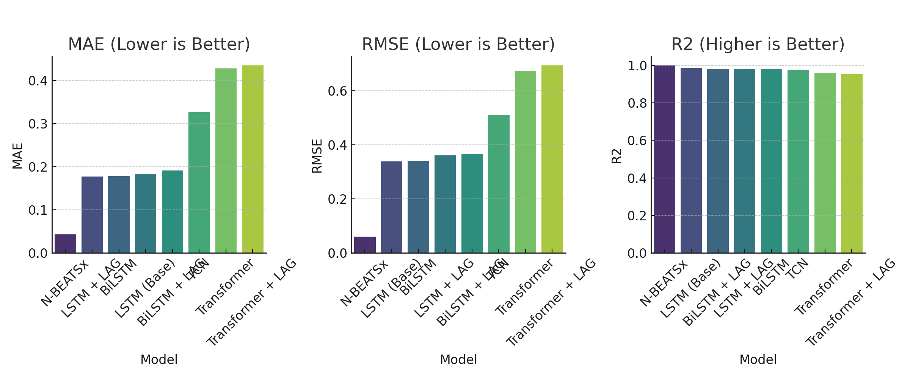

# Groundwater Forecasting Model Comparison

This document summarizes the experimental setup and results of multiple deep learning models applied to groundwater level forecasting.

---

## 1. Dataset

* **Source**: `JeJu_merged.csv`
* **Targets**: 6 groundwater well levels (`1_1_water` to `2_3_water`)
* **Horizons**: Predictions made for `t+30`, `t+90`, `t+180`, `t+360` days
* **Window Map**: `{30: 90, 90: 180, 180: 360, 360: 540}`
* **Scaling**: `StandardScaler` applied to inputs and outputs

---

## 2. Model Summary Table

| Model           | Architecture          | LAG | Loss         | Output File                    |
| --------------- | --------------------- | --- | ------------ | ------------------------------ |
| LSTM (Base)     | LSTM (Unidirectional) | No  | SmoothL1Loss | `lstm_layer1_report.pdf`       |
| BiLSTM          | BiLSTM                | No  | SmoothL1Loss | `bilstm_report.pdf`            |
| LSTM + LAG      | BiLSTM                | Yes | SmoothL1Loss | `bilstm_with_lag_report.pdf`   |
| BiLSTM + LAG    | BiLSTM                | Yes | SmoothL1Loss | `bilstm_with_lag_report.pdf`   |
| TCN             | Temporal CNN          | Yes | MSELoss      | `tcn_report.pdf`               |
| Transformer     | Transformer Encoder   | No  | MSELoss      | `transformer_report_nolag.pdf` |
| Transformer+LAG | Transformer Encoder   | Yes | MSELoss      | `transformer_report.pdf`       |
| N-BEATSx        | Stacked FC Blocks     | Yes | MSELoss      | `nbeats_report.pdf`            |

---

## 3. Hyperparameters (All models)

| Model           | Layers | Hidden Dim | Batch Size | Epochs | LR    |
| --------------- | ------ | ---------- | ---------- | ------ | ----- |
| LSTM (Base)     | 2      | 128        | 64         | 100    | 0.001 |
| BiLSTM          | 2      | 128        | 64         | 100    | 0.001 |
| LSTM + LAG      | 2      | 128        | 64         | 100    | 0.001 |
| BiLSTM + LAG    | 2      | 128        | 64         | 100    | 0.001 |
| TCN             | 4      | 64         | 32         | 100    | 0.001 |
| Transformer     | 2      | 128        | 32         | 100    | 0.001 |
| Transformer+LAG | 2      | 128        | 32         | 100    | 0.001 |
| N-BEATSx        | 4x3x2  | 128        | 32         | 100    | 0.001 |

---

## 4. Evaluation Metrics (Overall Average)

| Metric | Best Model |
| ------ | ---------- |
| MAE    | N-BEATSx   |
| MSE    | N-BEATSx   |
| RMSE   | N-BEATSx   |
| R²     | N-BEATSx   |

---

## 5. Evaluation by Well

* For all 6 wells, **N-BEATSx** achieved the best performance across **all metrics** (MAE, MSE, RMSE, R²)

### Heatmaps by Well

* 
* 
* 
* 

---

## 6. Evaluation by Horizon

* Across all time horizons (`t+30`, `t+90`, `t+180`, `t+360`), **N-BEATSx** consistently outperformed other models on **all metrics**

### Heatmaps by Horizon

* 
* 
* 
* 

---

## 7. Experimental Validity

All models were trained and evaluated under the same conditions:

* Identical data splits, scaling, and time horizons
* Same evaluation metrics (MAE, MSE, RMSE, R²)
* Matching learning rate (0.001), epochs (100), and window sizes
* Only minor variation: some models use `SmoothL1Loss` vs `MSELoss` during training (evaluation remains comparable)

✅ **Conclusion**: Results are fairly comparable, and `N-BEATSx` shows the most promising performance across the board.
